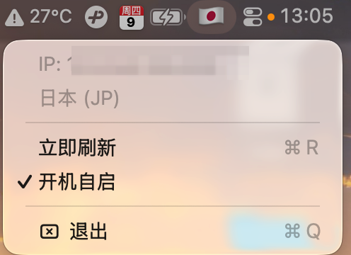

# ipflag

A macOS menu-bar utility that shows the flag emoji of the country your current
public IP is in. It updates automatically when you switch VPN or change networks.

Native Swift (AppKit), no third-party dependencies, no Dock icon.

<p align="center">
  
</p>

<p align="center"><b>English</b> | <a href="README.zh-CN.md">中文</a></p>

## Build

```bash
./build.sh
```

Produces `build/ipflag.app`.

## Run

```bash
open build/ipflag.app
```

The menu bar shows 🌐 first, then switches to your current country's flag
(e.g. 🇯🇵). Click the icon for the menu:

- **IP / Country** — current public IP and country (localized name + 2-letter code), read-only
- **Refresh now** — re-locate manually
- **Launch at login** — start automatically at login (toggle)
- **Quit** — close the app

## How it works

1. Queries HTTPS geolocation providers in order (`ipinfo.io` → `ipwho.is` →
   `api.ip.sb`) and uses the first that succeeds, so one provider being down or
   rate-limited doesn't break the app. Returns the public IP and 2-letter country code.
2. The country code is turned into Regional Indicator symbols — the flag emoji.
3. The localized country name comes from the system `Locale`, no API needed.
4. Refresh triggers: on launch, every 15 minutes, on network path changes
   (`NWPathMonitor` — VPN / Wi-Fi switches), and when the menu opens (only
   re-locates if the last request was more than 60 s ago, to avoid hammering the
   providers).

## Notes

- **Privacy**: IP geolocation sends your public IP to the providers above — this
  is inherent to IP-based location.
- **Launch at login**: uses `SMAppService`. A locally / ad-hoc-signed app can
  usually still register; if it doesn't stick, move `ipflag.app` to Applications
  and retry. Manage it under System Settings › General › Login Items.
- System frameworks used: `AppKit`, `Foundation`, `Network`, `ServiceManagement`.

## License

[MIT](LICENSE)
